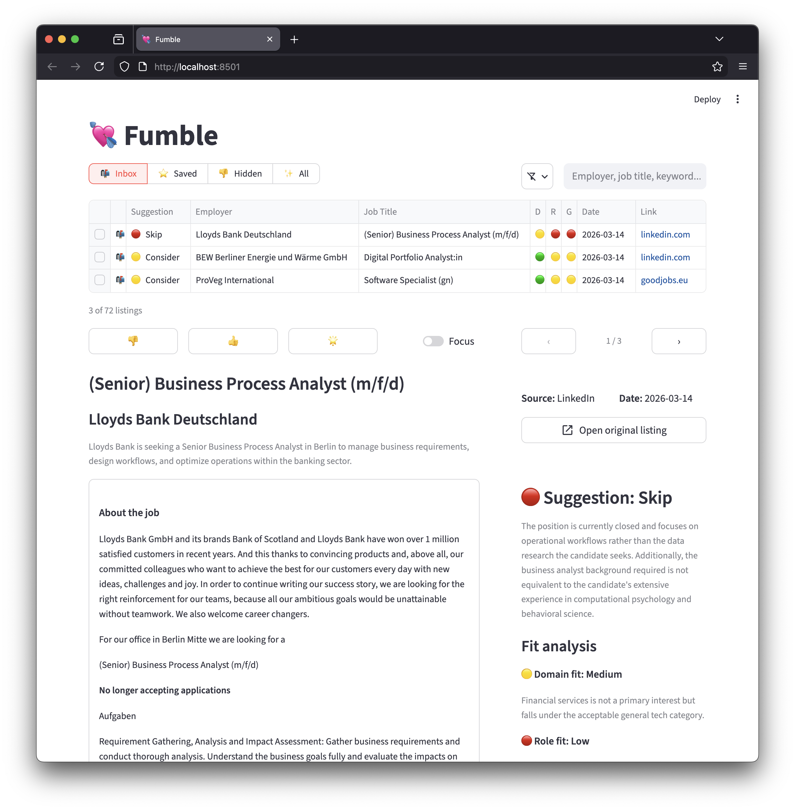

# Fumble



A job screening tool that makes job ad discovery just as fun (🤷‍♂️) as Tinder. Fumble scrapes listings from your job alert emails, has an LLM assess each one against your profile and criteria, then lets you swipe through the results: liking, skipping, or superliking, until your inbox is clear.

## How it works

1. **Fetch** — connects to your IMAP mailbox and extracts job URLs from configured email folders (StepStone, LinkedIn, etc.)
2. **Scrape** — opens each URL in a headless Chromium browser (Playwright), follows redirects, and extracts the page text
3. **Extract** — an LLM cleans the raw page text into a structured job listing (employer, title, language, listing text)
4. **Assess** — a second LLM call scores the listing on domain fit, role fit, and gap risk against your profile and criteria, and produces a structured assessment with fit areas, gaps, and an overall recommendation
5. **Store** — results are saved to `data/fumble.db` (SQLite)
6. **Review** — browse, filter, rate, and bookmark results in the dashboard

URLs are cached after processing — re-running over the same date range skips already-seen URLs without re-scraping.

## Setup

### Requirements

- Python 3.12+
- [uv](https://docs.astral.sh/uv/) (recommended) or pip
- [Ollama](https://ollama.com) running locally (or an OpenAI / Anthropic API key)
- A Playwright-compatible Chromium install: `playwright install chromium`

### Install

```bash
# Install dependencies into a local venv
uv sync

# Install fumble as a global tool so you can run it from any directory
uv tool install --editable .
```

After tool install, two commands are available globally:

| Command | Description |
|---|---|
| `fumblebee` | Run the pipeline |
| `fumble` | Launch the dashboard |

### Configuration

Copy `.env.example` to `.env` and fill in:

```
# IMAP credentials
IMAP_HOST=imap.example.com
IMAP_EMAIL=you@example.com
IMAP_PASSWORD=yourpassword

# LLM — defaults to Ollama with llama3.1:8b
LLM_PROVIDER=ollama        # ollama | openai | anthropic
LLM_MODEL=qwen3.5:9b
```

Edit `resources/sources.toml` to configure which email folders to scan and what URL patterns to extract.

Copy `resources/profile.example.md` → `resources/profile.md` and `resources/search-criteria.example.md` → `resources/search-criteria.md`, then fill them in with your background and job search criteria. These files are gitignored so your personal details stay local.

### LinkedIn

LinkedIn requires a logged-in browser session. Run this once before the first pipeline run:

```
fumblebee --login-linkedin
```

Log in inside the browser window, then press Enter in the terminal. The session is saved to `data/browser_profile/` and reused automatically on every subsequent scrape.

## Usage

### Run the pipeline

```
fumblebee [options]
```

| Argument | Default | Description |
|---|---|---|
| `--days N` | `3` | Fetch emails from the last N days |
| `--unread` | off | Only process unread emails |
| `--url URL` | — | Process a specific URL directly, bypassing email fetch (can be repeated) |
| `--force` | off | Ignore the seen-URL cache and reprocess all fetched URLs |
| `--reassess` | off | Re-run LLM fit assessment on all stored listings without re-scraping; preserves ratings |
| `--clear-ratings` | off | Reset all user ratings to `new` (prompts for confirmation) |
| `--mark-read` | off | Mark fetched emails as read after processing |
| `--login-linkedin` | off | Open a headed browser to log in to LinkedIn and save the session |

### Run the dashboard

```
fumblebee
```

The dashboard lets you:
- Switch between **Inbox** (unrated), **Saved** (liked/superliked), **Hidden** (disliked), and **All** views
- Refine by recommendation, domain fit, role fit, gap risk, employer, and job title via the filter popover
- View the full job listing alongside the structured AI assessment — fit areas, gaps with severity, and per-dimension explanations
- Rate entries with 🌟 superlike / 👍 like / 👎 dislike; rated entries auto-advance to the next listing
- Toggle **focus mode** to hide the table and controls for distraction-free swiping
- Permanently delete entries

**Keyboard shortcuts**

| Key | Action |
|-----|--------|
| `k` / `→` | Next listing |
| `j` / `←` | Previous listing |
| `3` | Superlike |
| `2` | Like |
| `1` | Dislike |
| `g i` | Go to Inbox |
| `g s` | Go to Saved |
| `g h` | Go to Hidden |
| `g a` | Go to All |
| `f` | Toggle focus mode |
| `/` | Focus search bar |
| `Esc` | Blur search bar |

## LLM providers

Sift supports Ollama (local), OpenAI, and Anthropic via the `LLM_PROVIDER` and `LLM_MODEL` env vars. Only the SDK for the active provider needs to be installed.

| Provider | Example model | Notes |
|---|---|---|
| `ollama` | `qwen3.5:14b` | Default. Runs locally, no API cost. |
| `openai` | `gpt-4o` | Requires `OPENAI_API_KEY` |
| `anthropic` | `claude-opus-4-6` | Requires `ANTHROPIC_API_KEY` |

Currently only tested on a M4 Pro 24GB MacBook Pro with Ollama using `qwen3.5:9b`. `llama3.2` is much faster, but noticably inferior in results for both scraping and assessment. 

## Project structure

```
main.py                  # Pipeline entry point
fumble/
  email_fetch.py         # IMAP connection and URL extraction
  scrape.py              # Playwright scraping + persistent browser session
  extract.py             # LLM-based listing extraction
  assess.py              # LLM-based fit assessment
  llm.py                 # Provider-agnostic LLM call layer
  store.py               # SQLite persistence
  dashboard.py           # Streamlit dashboard
resources/
  profile.md             # Candidate profile (read by LLM) — gitignored, copy from profile.example.md
  search-criteria.md     # Job search criteria (read by LLM) — gitignored, copy from search-criteria.example.md
  profile.example.md     # Template for profile.md
  search-criteria.example.md  # Template for search-criteria.md
  sources.toml           # Email folder and URL pattern configuration
data/
  fumble.db              # SQLite database (gitignored)
  browser_profile/       # Persistent Playwright session (gitignored)
  failures.log           # Scrape/extraction failure log
```
